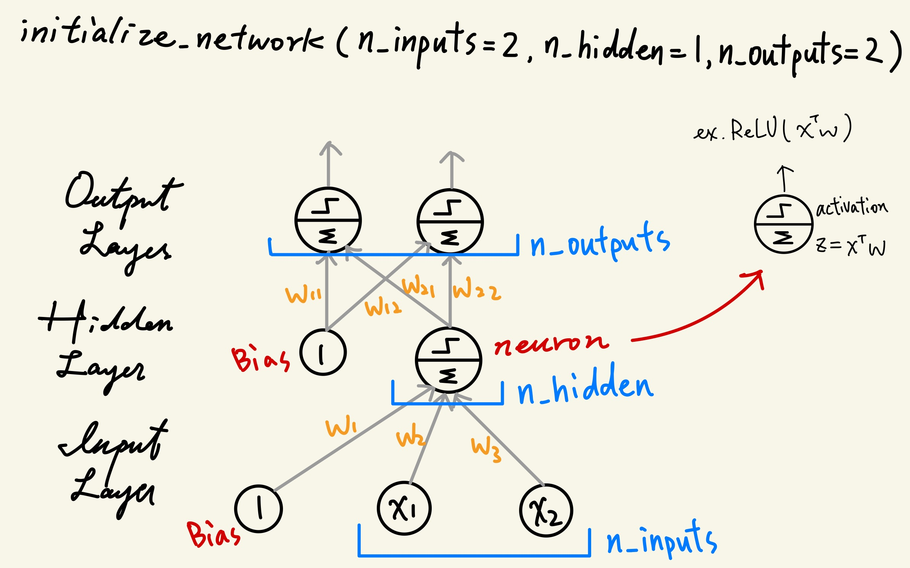

# Neural-Network
Replicate the *Back Propagation Algorithm* behind the neural network from [**How to Code a Neural Network with Backpropagation In Python (from scratch)**](https://machinelearningmastery.com/implement-backpropagation-algorithm-scratch-python/) by Jason Brownlee

